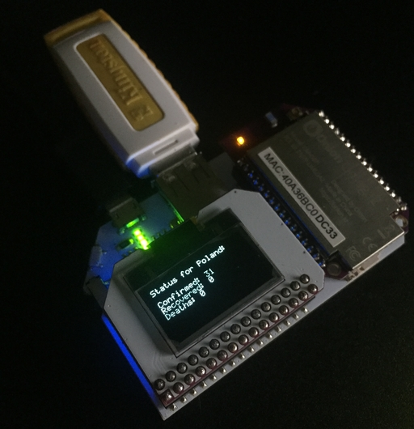

# onion-omega2-coronavirus-oled

> Display coronavirus stats on the Omega Onion 2 OLED Extension

## Demo

## About

This project uses the [coronavirusapi.me](https://coronavirusapi.me/) GraphQL API to fetch recent coronavirus stats. It then displays them on the OLED screen. Data refetch happens every hour.

## Hardware Requirements

- Onion [Omega2](https://onion.io/store/omega2/)/[2+](https://onion.io/store/omega2p/)/[2 Pro](https://onion.io/store/omega2-pro/) IoT computer
- [OLED Expansion](https://onion.io/store/oled-expansion/)

## Installation & Usage

1. Install Node.js & npm for Onion (follow [this](https://docs.onion.io/omega2-docs/installing-and-using-nodejs.html) guide)
2. Install git for Onion (follow [this](https://docs.onion.io/omega2-docs/installing-and-using-git.html) guide)
3. Run `git clone https://github.com/xxczaki/omega-onion2-coronavirus-oled/`
4. Run `cd omega-onion2-coronavirus-oled`
5. Run `node --max_old_space_size=64 $(which npm) install --production`
6. Run `node index.js`
7. Done!

## License

MIT
